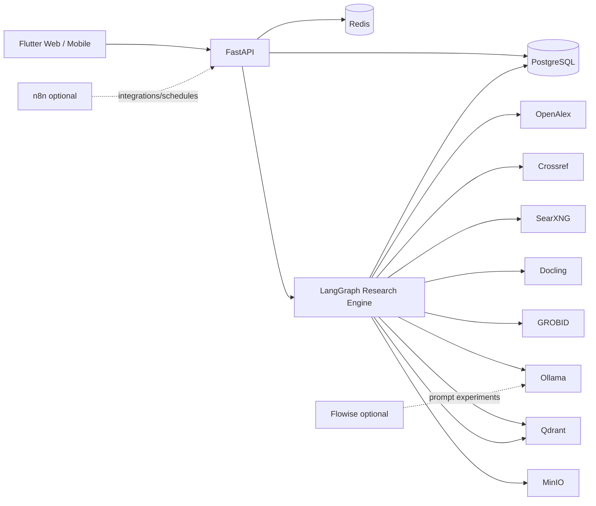
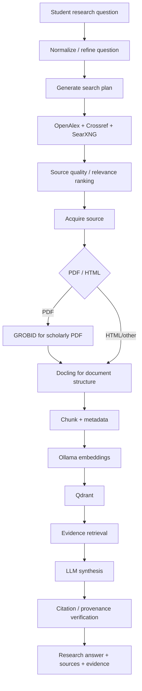

# Academic Research AI — V1 Foundation

This implementation starts the architecture agreed in the previous design discussion:
**open-source academic research infrastructure first, exam intelligence as one module**.

The uploaded v2 architecture established Flutter + FastAPI + LangGraph + Ollama + Qdrant + PostgreSQL + SearXNG + Docker as the base. V1 extends it with scholarly discovery, provenance-oriented data structures, Redis job state, MinIO-compatible object storage, Docling, and GROBID. The exam-paper workflow remains a module rather than the platform boundary.

## V1 goal

A student can:

1. create a research project;
2. enter a research question;
3. start a research run;
4. search scholarly + web sources;
5. collect source metadata;
6. retrieve documents/pages where possible;
7. extract structured text;
8. generate a cited evidence-oriented answer;
9. inspect sources and evidence;
10. later export the research package.

## Services

- `api`: FastAPI
- `postgres`: relational metadata/provenance
- `redis`: job/event state
- `qdrant`: vector retrieval
- `ollama`: local LLM + embeddings
- `searxng`: web discovery
- `grobid`: scholarly PDF structure/reference extraction
- `minio`: object storage for downloaded source files
- `flutter_app`: student client (starter)
- optional `n8n` and `flowise`: integration/AI experimentation only

## Start

```bash
cp .env.example .env
docker compose up -d --build
```

Pull local models:

```bash
docker exec -it academic-research-ai-ollama-1 ollama pull qwen2.5:7b
docker exec -it academic-research-ai-ollama-1 ollama pull nomic-embed-text
```

API docs:

```text
http://localhost:8000/docs
```

Qdrant:

```text
http://localhost:6333/dashboard
```

SearXNG:

```text
http://localhost:8080
```

GROBID:

```text
http://localhost:8070
```

MinIO:

```text
http://localhost:9001
```

## First API flow

Create project:

```bash
curl -X POST http://localhost:8000/api/v1/projects \
  -H 'Content-Type: application/json' \
  -d '{"name":"AI in Agriculture","description":"Literature review on AI applications in agriculture"}'
```

Create research question:

```bash
curl -X POST http://localhost:8000/api/v1/projects/1/questions \
  -H 'Content-Type: application/json' \
  -d '{"question":"How is AI being used to improve crop disease detection?"}'
```

Start research:

```bash
curl -X POST http://localhost:8000/api/v1/questions/1/research
```

Inspect the run:

```bash
curl http://localhost:8000/api/v1/research-runs/1
```

## Architecture



## Research pipeline



## Product modules

```text
Academic Research AI
├── Research Workspace
├── Research Question Assistant
├── Scholarly Search
├── Web Search
├── Paper Reader / Analyzer
├── Evidence & Citation Manager
├── Literature Review
├── Research Gap Finder
├── Project Idea Generator
├── Exam Paper Intelligence
├── Study Planner
└── Export / Sharing
```

## Quality rule

The product must distinguish:

- source fact;
- model inference;
- student hypothesis;
- unsupported/generated content.

The long-term platform should never silently turn an LLM inference into a source-backed fact.

## V1 limitations

This is the foundation release. It does not yet implement production authentication, distributed workers, full PDF OCR fallback, advanced hybrid retrieval, cross-encoder reranking, citation-style formatting, or a complete mobile UX. Those are explicitly staged in `docs/ROADMAP.md`.

## Open-source boundary

The core research path does not depend on n8n or Flowise. They are optional. This preserves a clean open-source-first architecture and keeps the reproducible research engine in version-controlled Python/LangGraph code.
